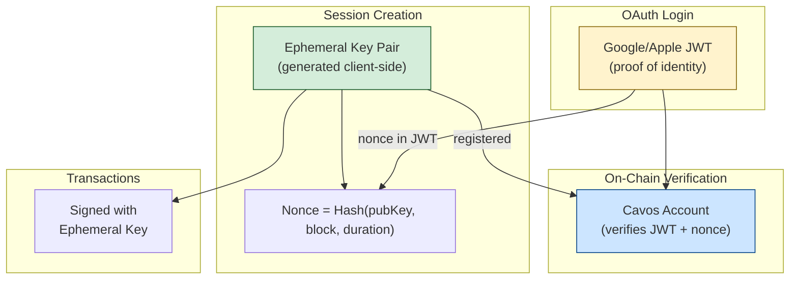

## Architecture Overview

Cavos uses **ephemeral session keys** bound to OAuth JWTs. Instead of storing a master private key, the SDK generates a fresh key pair on each login that's cryptographically linked to the user's verified identity.



## How Sessions Work

### 1. Session Initialization (Pre-Login)

When you call `login()`, the SDK:

```typescript
// Generated BEFORE OAuth redirect
const ephemeralPrivateKey = generateStarkKey();  // Random 252-bit key
const ephemeralPubKey = derivePublicKey(privateKey);

// Compute nonce that binds the JWT to this session
const nonce = poseidon([
  ephemeralPubKey,
  currentBlock,
  sessionDuration,
  renewalGracePeriod,
  randomness
]);
```

### 2. OAuth Redirect

The nonce is included in the OAuth request:

```
https://accounts.google.com/o/oauth2/v2/auth?
  nonce={computed_nonce}&
  client_id=...&
  redirect_uri=...
```

### 3. JWT Verification

When the user completes OAuth, Google/Apple returns a JWT containing:

```json
{
  "iss": "https://accounts.google.com",
  "sub": "1234567890",
  "aud": "your-client-id",
  "nonce": "0x1a2b3c...",  // Our computed nonce
  "exp": 1699900000
}
```

### 4. On-Chain Registration

The first transaction registers the session by verifying:

```cairo
fn register_session(jwt, session_signature) {
    // 1. Verify JWT signature against JWKS registry
    let pubkey = jwks_registry.get_key(jwt.kid);
    verify_rsa_signature(jwt, pubkey);
    
    // 2. Verify nonce matches expected format
    let expected_nonce = poseidon([
        session.ephemeral_pub,
        session.max_block,
        session.randomness
    ]);
    assert(jwt.nonce == expected_nonce);
    
    // 3. Store session as authorized signer
    self.sessions.write(session.ephemeral_pub, SessionData {
        is_registered: true,
        max_block: session.max_block,
        jwt_claims_hash: hash(jwt.sub, jwt.aud)
    });
}
```

## Session Data Structure

```typescript
interface OAuthSession {
  // Identity
  jwt: string;                    // Full JWT for registration
  jwtClaims: {
    sub: string;                  // User identifier
    iss: string;                  // Issuer (google/apple)
    aud: string;                  // Client ID
    nonce: string;                // Bound to ephemeral key
    exp: number;                  // Expiration
  };
  
  // Ephemeral Key
  ephemeralPrivateKey: string;    // Signs all transactions
  ephemeralPubKey: string;        // Registered on-chain
  
  // Session Bounds
  nonceParams: {
    maxBlock: bigint;             // Session expires at this block
    renewalDeadline: bigint;      // Can renew until this block
    randomness: bigint;           // Prevents replay
  };
  
  // Derived
  addressSeed: string;            // poseidon(sub, salt)
  walletAddress: string;          // Contract address
}
```

## Transaction Signing Flow

### First Transaction (Registers Session)

```typescript
// Full JWT signature required
const signature = [
  SIGNATURE_TYPE.JWT,          // Type marker
  ...jwtChunks,                // JWT split into felts
  ...kidHex,                   // Key ID for JWKS lookup
  ephemeralPubKey,
  maxBlock,
  randomness,
  ...sessionSignature,         // ECDSA from ephemeral key
];
```

### Subsequent Transactions (Session Only)

```typescript
// Lightweight session signature
const signature = [
  SIGNATURE_TYPE.SESSION,      // Type marker
  ephemeralPubKey,
  ...sessionSignature,         // ECDSA from ephemeral key
];
```

This is ~10x cheaper because no JWT verification is needed.

## Session Lifecycle

```
┌─────────────────────────────────────────────────────────────────┐
│  Login          First TX         Transactions        Logout    │
│    │               │                  │                 │      │
│    ▼               ▼                  ▼                 ▼      │
│ Generate      Register on        Use session        Clear      │
│ ephemeral     chain (JWT)        signature          session    │
│ key pair      ~$0.02             ~$0.002 each       storage    │
└─────────────────────────────────────────────────────────────────┘
```

## Session Duration

| Parameter | Default | Description |
|-----------|---------|-------------|
| `sessionDuration` | 2880 blocks (~24h) | Max blocks session is valid |
| `renewalGracePeriod` | 2880 blocks (~24h) | Window to renew before expiry |

### Session Renewal

Before a session expires, users can renew with a fresh JWT:

```typescript
const newTxHash = await cavos.renewSession();
```

This generates new ephemeral keys and registers them on-chain.

## Security Properties

### What the Ephemeral Key Can Do

| Action | Allowed? |
|--------|----------|
| Sign transactions from this wallet | ✅ |
| Sign after session expires | ❌ |
| Sign for a different wallet | ❌ |
| Be reused in a new session | ❌ |

### What It Cannot Do

- **Steal funds permanently**: Session expires automatically
- **Be transferred**: Bound to specific JWT nonce
- **Sign for other apps**: Each app has different wallet (per-app salt)

## Session Storage

Sessions are stored in browser `sessionStorage`:

```typescript
// Automatically cleared when browser tab closes
sessionStorage.getItem('cavos_oauth_session');
```

<Warning>
If you need persistent sessions across browser closes, implement your own session refresh logic using `renewSession()` on app load.
</Warning>

## Troubleshooting

### "No session found"

Session wasn't initialized or was cleared:

```typescript
// Check if authenticated
if (!isAuthenticated) {
  await login('google');
}
```

### "Session expired"

Session's `maxBlock` has been exceeded:

```typescript
// Renew the session
await renewSession();
```

### "Address seed mismatch"

JWT claims changed or salt mismatch:

```typescript
// Clear session and re-login
await logout();
await login('google');
```

## Code Example: Full Flow

```typescript
import { useCavos } from '@cavos/react';

function WalletApp() {
  const { 
    isAuthenticated, 
    address, 
    login, 
    execute,
    renewSession,
    logout,
    walletStatus 
  } = useCavos();

  // Login creates ephemeral session
  const handleLogin = () => login('google');

  // Execute uses session key automatically
  const handleTransfer = async () => {
    const txHash = await execute({
      contractAddress: TOKEN_ADDRESS,
      entrypoint: 'transfer',
      calldata: [recipient, amount],
    });
  };

  // Check if session needs renewal
  useEffect(() => {
    if (walletStatus.isReady && !walletStatus.isSessionActive) {
      renewSession();
    }
  }, [walletStatus]);

  return (
    <div>
      {isAuthenticated ? (
        <>
          <p>Wallet: {address}</p>
          <button onClick={handleTransfer}>Transfer</button>
          <button onClick={logout}>Logout</button>
        </>
      ) : (
        <button onClick={handleLogin}>Login with Google</button>
      )}
    </div>
  );
}
```
