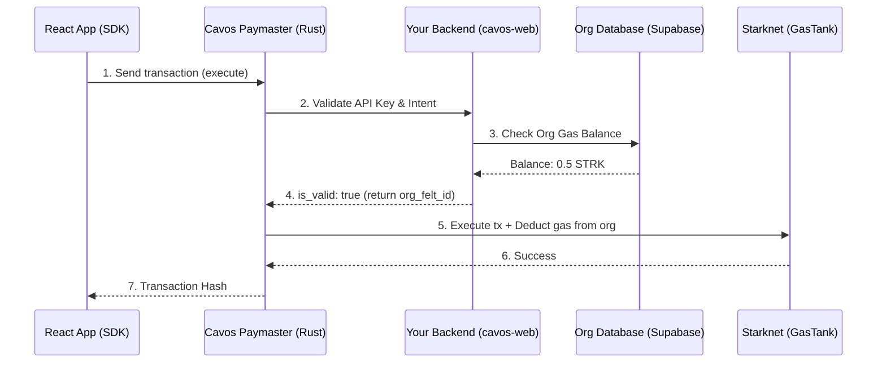

Cavos is designed to provide **gasless transactions by default**. This means your users never need to hold ETH or STRK to use your decentralized application. 

Behind the scenes, Cavos abstracts gas payments using a robust architecture consisting of three core components: the **Paymaster**, the **Webhook Validator**, and the on-chain **GasTank**.

## Architecture Overview

### 1. The Cavos Paymaster
The **Cavos Paymaster** (built in Rust) is the entry point for all transactions originating from the React SDK. It sits between your front-end application and the Starknet blockchain.
- **Role**: Receives the raw transaction intent, queries the webhook for validation, signs the transaction with the relayer key, and submits it to Starknet using SNIP-9 (Outside Execution).
- **Endpoint**: `https://paymaster.cavos.xyz`

### 2. The Webhook Validator
Before the Paymaster pays the gas for a transaction, it needs to know if the application (your organization) is authorized and has sufficient funds. It does this by sending a synchronous HTTP request to your backend webhook (`cavos-web/app/api/gas/webhook`).
- **Authorization**: Validates the `x-paymaster-api-key`.
- **Gas Checking**: Checks the organization's cached gas balance in the database (e.g., Supabase table `org_gas_balances`). 
- **Response**: If the balance is > 0.001 STRK, it returns `is_valid: true` along with the `org_felt_id` as `sponsor_metadata`. 
- **Errors**: If the webhook returns `is_valid: false` (e.g., balance is 0), the Paymaster rejects the transaction with `"x-paymaster-api-key is invalid"`.

### 3. The On-Chain GasTank
The **GasTank** is a Starknet smart contract that holds the actual STRK tokens deposited by developers/organizations.
- **Deposit**: When you fund your organization, you deposit STRK into the GasTank contract using your `org_felt_id`.
- **Deduction**: After a transaction successfully executes on Starknet, the Paymaster explicitly calls the GasTank's `deduct` function, subtracting the exact gas cost from your organization's on-chain balance.
- **Admins**: Only authorized relayers and the estimation account can call the `deduct` function, preventing any unauthorized drainage of the pool.

---

## Testing on Sepolia vs Mainnet

The Cavos Paymaster behaves differently depending on the network configuration:

### Sepolia (Testnet)
On Sepolia, Cavos operates a **Free Pool**. You do not need to deposit testnet STRK to use the SDK.
- The webhook automatically returns `is_valid: true` and assigns the transaction to the `SEPOLIA_FREE_POOL_FELT_ID`.
- The Cavos relayers absorb the cost of the testnet transactions.

### Mainnet (Production)
On Mainnet, transactions are strictly isolated by organization.
- You **must** deposit real STRK into the Mainnet GasTank contract before your users can execute transactions.
- The webhook verifies your exact balance and strictly enforces the threshold. Ensure you monitor your `org_gas_balances` to prevent user transactions from suddenly failing.

## Resolving "x-paymaster-api-key is invalid"

If your users suddenly see an error in the console stating that the `x-paymaster-api-key is invalid` during account deployment or transaction execution, this almost always means **your organization has run out of gas**.

**How to fix:**
1. Check your organization's gas balance via the Cavos Dashboard.
2. Deposit STRK to the displayed GasTank contract address.
3. Refresh the UI to sync the on-chain balance to the `cavos-web` database.
