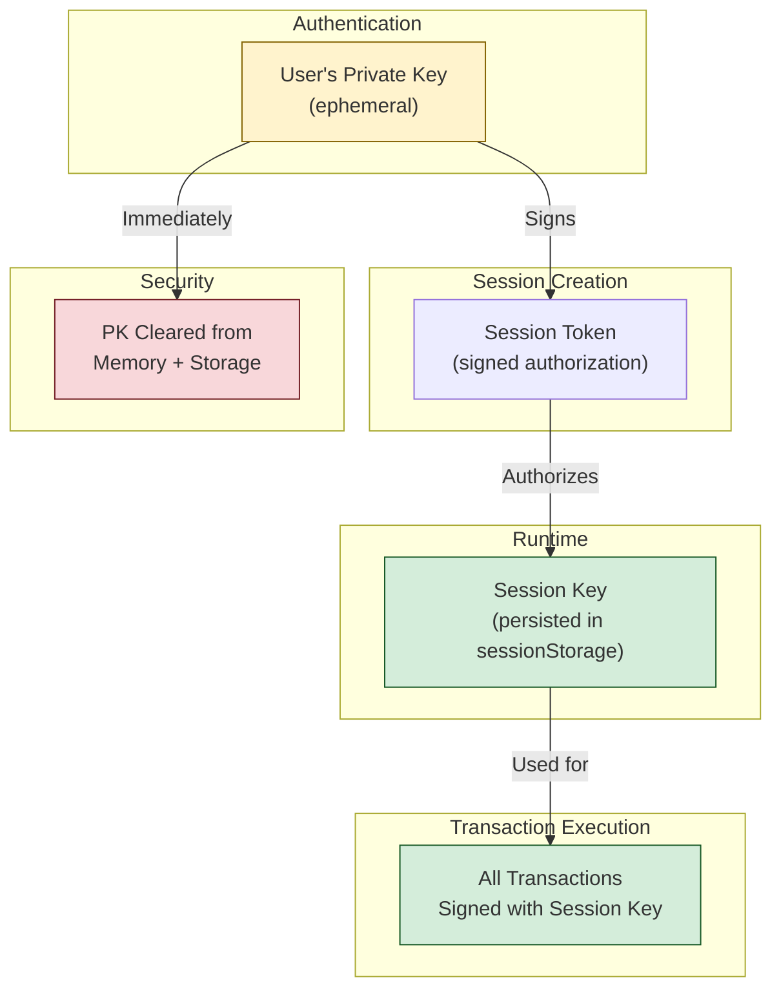

## Architecture Overview

Session keys are the **core transaction signing mechanism** in Cavos. The user's private key is ephemeral - it exists only during session creation and is immediately cleared afterward.



## Key Components

### Session Token

The session token is a signed authorization that grants the session key permission to execute specific transactions:

```typescript
interface SessionToken {
  session: Session;                    // Policy + metadata
  sessionAuthorization: string[];      // Owner's signature
  sessionSignature: Signature;         // Session key signature
  guardianSignature: Signature;        // Guardian key signature
  sessionKeyPublicKey: string;         // Session keypair public key
  guardianKeyPublicKey: string;        // Guardian keypair public key
  calls: Call[];                       // Transactions being executed
}
```

### Session Policy (On-Chain)

The policy is enforced both client-side and on-chain:

```typescript
interface Session {
  expires_at: bigint;                  // Unix timestamp
  allowed_methods_root: string;        // Merkle root of allowed methods
  metadata_hash: string;               // Hash of metadata
  session_key_guid: bigint;            // Unique session identifier
}
```

### Allowed Methods (Merkle Tree)

Methods are stored in a Merkle tree for efficient on-chain validation:

```typescript
const allowedMethods = [
  { contractAddress: '0x...token', selector: 'transfer' },
  { contractAddress: '0x...token', selector: 'approve' },
  { contractAddress: '0x...nft', selector: 'mint' },
];

// Converted to Merkle tree leaves
const leaves = allowedMethods.map(m => 
  poseidonHashMany([BigInt(m.contractAddress), BigInt(selector.getSelectorFromName(m.selector))])
);
```

## Session Creation Flow

```typescript
// 1. Generate session keypair (Stark curve)
const sessionPrivateKey = ec.starkCurve.utils.randomPrivateKey();
const sessionPublicKey = ec.starkCurve.getPublicKey(sessionPrivateKey);

// 2. Generate guardian keypair (additional security layer)
const guardianPrivateKey = ec.starkCurve.utils.randomPrivateKey();
const guardianPublicKey = ec.starkCurve.getPublicKey(guardianPrivateKey);

// 3. Build session typed data
const sessionTypedData = buildSessionTypedData(
  chainId,
  accountAddress,
  allowedMethods,
  expiresAt,
  sessionPublicKey,
  guardianPublicKey
);

// 4. Sign with owner's private key (ONLY time PK is used)
const authorization = await account.signMessage(sessionTypedData);

// 5. IMMEDIATELY clear private key
walletManager.clearPrivateKey();

// 6. Store session data in sessionStorage
sessionStorage.setItem('cavos_session', JSON.stringify({
  sessionPrivateKey,
  guardianPrivateKey,
  authorization,
  policy,
  accountAddress,
}));
```

## Transaction Execution Flow

```typescript
// 1. Build transaction(s)
const calls = [{ contractAddress, entrypoint, calldata }];

// 2. Validate against policy (client-side)
for (const call of calls) {
  const isAllowed = session.allowedMethods.some(
    m => m.contractAddress === call.contractAddress && m.selector === call.entrypoint
  );
  if (!isAllowed) throw new Error('Method not allowed by session');
}

// 3. Build paymaster typed data
const paymasterTypedData = await fetchPaymasterTypedData(calls);

// 4. Sign with session key (NOT owner's PK!)
const messageHash = typedData.getMessageHash(paymasterTypedData, accountAddress);
const sessionSignature = await sessionKey.sign(sessionWithMsgHash);
const guardianSignature = await guardianKey.sign(sessionWithMsgHash);

// 5. Compile session token
const sessionToken = new SessionToken({
  session,
  sessionAuthorization: authorization,
  sessionSignature,
  guardianSignature,
  sessionKeyPublicKey,
  guardianKeyPublicKey,
  calls,
});

// 6. Execute via paymaster
const txHash = await paymaster.execute(calls, sessionToken.compileSignature());
```

## Security Model

### Ephemeral Private Key

| Stage | PK State |
|-------|----------|
| Before login | Encrypted (passkey) |
| After login | Decrypted in memory |
| After createSession | **CLEARED** |
| During execute | Not available |

> [!CAUTION]
> After `createSession()`, calling any method that requires the private key will fail. Only session key operations work.

### Policy Enforcement

Policies are enforced at **three levels**:

1. **Client-side (SDK)**: Reject before sending
2. **Paymaster**: Validate session token
3. **On-chain (Account Contract)**: Final validation during execution

### Session Storage

Sessions are stored in `sessionStorage` (cleared on browser close):

```typescript
// Stored data
{
  sessionPrivateKey: string;
  guardianPrivateKey: string;
  authorization: string[];
  policy: SessionPolicy;
  accountAddress: string;
  chainId: string;
}
```

### Best Practices

1. **Short expiration**: 1 hour or less for sensitive operations
2. **Minimal scope**: Only methods your app needs
3. **Clear on logout**: Always call `clearSession()` on logout
4. **Validate UI state**: Check `hasActiveSession` before showing action buttons

## Argent Session Library

Cavos uses a custom implementation based on Argent's session key specification:

```
Session Account Contract: 0x036078334509b514626504edc9fb252328d1a240e4e948bef8d0c08dff45927f
```

### Signature Types

| Type ID | Description |
|---------|-------------|
| 0 | Standard owner signature |
| 1 | Session key signature |
| 2 | Multicall with session |

## Troubleshooting

### "No active session"

Session not created or has expired:

```typescript
if (!hasActiveSession) {
  await createSession(policy);
}
```

### "Method not allowed by session"

The call doesn't match any allowed method in the policy:

```typescript
// Check your policy includes the method
const policy = {
  allowedMethods: [
    { contractAddress: CONTRACT, selector: 'your_function' }, // Must match exactly
  ],
};
```

### "Session has expired"

Session past `expiresAt` timestamp:

```typescript
// Create new session
await createSession({
  ...policy,
  expiresAt: Date.now() + 60 * 60 * 1000, // New 1 hour session
});
```
