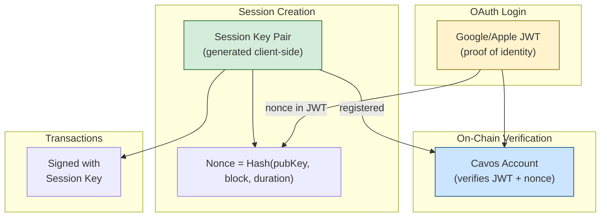
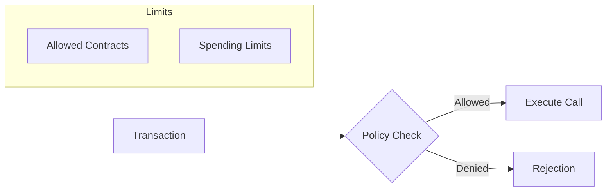

## Architecture Overview

Cavos uses **session keys** bound to OAuth JWTs. Instead of storing a master private key, the SDK generates a fresh session key pair on each login that's cryptographically linked to the user's verified identity.



## How Sessions Work

### 1. Session Initialization (Pre-Login)

When you call `login()`, the SDK:

```typescript
// Generated BEFORE OAuth redirect
const sessionPrivateKey = generateStarkKey();  // Random 252-bit key
const sessionPubKey = derivePublicKey(sessionPrivateKey);

// Compute nonce that binds the JWT to this session
const nonce = poseidon([
  sessionPubKey,
  currentBlock,
  sessionDuration,
  renewalGracePeriod,
  randomness
]);
```

### 2. OAuth Redirect

The nonce is included in the OAuth request to Google or Apple.

### 3. JWT Verification

When the user completes OAuth, the JWT returned contains the nonce, proving the identity is linked to that specific browser session.

### 4. On-Chain Registration

The first transaction registers the session by verifying the JWT signature and nonce on-chain.

## Session Management

The SDK provides methods to manage your active on-chain sessions.

### Session Renewal

Sessions have a limited duration (default 24h). Before they expire (or during the grace period), you can renew them:

```typescript
const txHash = await cavos.renewSession();
```

This generates a **new session key pair** and registers it on-chain using the old session's authorization (while it's still in the grace period).

## Session Policies

Session keys can be restricted by **policies** to limit the damage if a session key is compromised.

### 1. Allowed Contracts
You can restrict a session key to only be able to call specific contract addresses. This is implemented using a Merkle Tree of allowed contract addresses on-chain.

If a transaction attempts to call a contract not in the allowed list, the account contract will reject it.

### 2. Spending Limits
You can define maximum spending limits for specific tokens (e.g., STRK, ETH) per session. The account contract tracks the total amount spent by the session and prevents exceeding the limit.



## Session Revocation

If you suspect a session key has been compromised, or simply want to logout securely from a shared device, you have two options:

### 1. Revoke Specific Session
Invalidates a single session key on-chain.

```typescript
const { revokeSession } = useCavos();

// Revoke current session
await revokeSession();

// Or revoke a specific session key
await revokeSession('0x123...'); 
```

### 2. Emergency Revoke All
Invalidates **all** currently active sessions for the wallet by incrementing the global revocation epoch.

```typescript
const { emergencyRevokeAllSessions } = useCavos();

await emergencyRevokeAllSessions();
```

## Security Properties

- **Non-Custodial**: Neither Cavos nor the application ever sees your session private key. It lives only in your browser's memory.
- **Auto-Expiry**: Sessions automatically expire, minimizing the impact of a lost device or session key.
- **Per-App Isolation**: Each app uses a different derivation salt, so a session key for App A cannot sign for App B.
- **Enforced Policies**: Even if a session key is stolen, the attacker is limited by the allowed contracts and spending limits defined at session creation.


