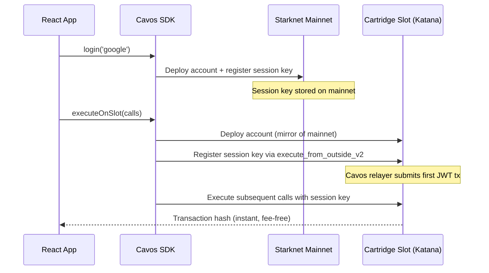

[Cartridge Slot](https://docs.cartridge.gg/slot) is a private, fee-free Katana chain forked from Starknet mainnet. It is purpose-built for games and high-throughput apps that need instant, zero-cost transactions.

Cavos integrates with Slot so that users can execute transactions on the Slot chain **without a paymaster** — Katana runs with `no_fee = true`, so gas is always free.

---

## How It Works



1. **Account deployment on mainnet** happens automatically after `login()`, as usual.
2. **First `executeOnSlot()` call** lazily deploys the account on Slot and registers the session key. The SDK uses a relayer (configurable or default) to handle the `execute_from_outside_v2` call needed for JWT verification.
3. **Subsequent `executeOnSlot()` calls** use the session key directly — no relayer, no paymaster, just a direct invoke.

---

## Configuration

Add `slot` to your `CavosProvider` config:

```tsx
import { CavosProvider } from '@cavos/react';

export function Providers({ children }) {
  return (
    <CavosProvider
      config={{
        appId: 'your-app-id',
        network: 'mainnet',         // Target network state
        paymasterApiKey: 'your-key',
        slot: {
          rpcUrl: 'https://api.cartridge.gg/x/your-project/katana',
          chainId: '0x57505f4341564f53', // hex of internal chain ID
          relayerAddress: '0x...',       // Optional: funded account on Slot
          relayerPrivateKey: '0x...',    // Optional: its private key
        },
      }}
    >
      {children}
    </CavosProvider>
  );
}
```

### `SlotConfig` Options

| Property | Type | Required | Description |
|----------|------|----------|-------------|
| `rpcUrl` | string | Yes | RPC URL of your Cartridge Katana Slot instance |
| `chainId` | string | Optional | Chain ID for the Slot chain. Defaults to the primary network's ID. You should provide the exact internal VM chain ID (e.g., `0x57505f4341564f53` for `WP_CAVOS`) to avoid signature mismatches. |
| `relayerAddress` | string | Optional | Account address to act as relayer for Slot deployment. Defaults to the built-in Cavos relayer. |
| `relayerPrivateKey` | string | Optional | Private key for the relayer account. |

> [!WARNING]
> **Important:** Katana sequencers often report `SN_MAIN` via their RPC, but use a custom internal chain ID inside the Cairo VM. Because the Cavos session registration signature depends on this internal chain ID, you **must** manually set the `chainId` in your config to match the internal ID of your Katana genesis (e.g., `WP_CAVOS` / `0x57505f4341564f53`). If you do not provide the correct internal `chainId`, you will encounter an **"Invalid session key signature"** error.

> [!IMPORTANT]
> **Address Parity:** On Cavos Slots, the `CavosAccount` class and `JWKSRegistry` are typically deployed at the **exact same addresses** as production (Sepolia/Mainnet). The SDK now automatically uses these parity addresses. You no longer need to provide `classHash` or `jwksRegistryAddress` in the `SlotConfig`.

> [!NOTE]
> If `slot` is not present in the config, nothing Slot-related happens — `executeOnSlot()` will throw.

---

## Finding your internal Katana Chain ID

Since you cannot rely on the RPC `starknet_chainId` method to give you the internal VM chain ID of your Slot or Katana node, you must query it directly from within the Cairo VM.

You can do this by deploying a minimalistic Cairo contract that returns `get_tx_info().chain_id`:

```cairo
#[starknet::interface]
pub trait ICheckChainId<TContractState> {
    fn get_chain_id(self: @TContractState) -> felt252;
}

#[starknet::contract]
pub mod CheckChainId {
    use starknet::info::get_tx_info;

    #[storage]
    struct Storage {}

    #[abi(embed_v0)]
    impl CheckChainIdImpl of super::ICheckChainId<ContractState> {
        fn get_chain_id(self: @ContractState) -> felt252 {
            get_tx_info().unbox().chain_id
        }
    }
}
```

1. Deploy the contract above to your Katana node using `starkli`.
2. Call the `get_chain_id` function:
   ```bash
   starkli call <contract_address> get_chain_id --rpc https://api.cartridge.gg/x/your-project/katana
   ```
3. Use the exact hexadecimal result in your `slot.chainId` configuration array.

---

## Executing Transactions on Slot

Use `executeOnSlot()` instead of `execute()` to route transactions to the Slot chain:

```tsx
import { useCavos } from '@cavos/react';

function GameAction() {
  const { executeOnSlot, walletStatus } = useCavos();

  const handleMove = async () => {
    const txHash = await executeOnSlot({
      contractAddress: GAME_CONTRACT_ADDRESS,
      entrypoint: 'make_move',
      calldata: ['42', '7'],
    });

    console.log('Move submitted on Slot:', txHash);
  };

  return (
    <button onClick={handleMove} disabled={!walletStatus.isReady}>
      Make Move
    </button>
  );
}
```

### Multicall on Slot

```tsx
const txHash = await executeOnSlot([
  {
    contractAddress: RESOURCE_CONTRACT,
    entrypoint: 'collect',
    calldata: [playerId],
  },
  {
    contractAddress: GAME_CONTRACT,
    entrypoint: 'upgrade',
    calldata: [buildingId, '1'],
  },
]);
```

---

## Session Policy on Slot

The session policy configured in `CavosProvider` (`session.defaultPolicy`) applies to both mainnet and Slot transactions. Configure `allowedContracts` to include your Slot game contracts:

```tsx
<CavosProvider
  config={{
    appId: 'your-app-id',
    network: 'mainnet',
    paymasterApiKey: 'your-key',
    session: {
      defaultPolicy: {
        allowedContracts: [
          GAME_CONTRACT_ADDRESS,    // Same address on Slot as mainnet
          RESOURCE_CONTRACT_ADDRESS,
        ],
        maxCallsPerTx: 10,
      },
    },
    slot: {
      rpcUrl: 'https://api.cartridge.gg/x/your-project/katana',
    },
  }}
>
```

---

## Differences from `execute()`

| | `execute()` | `executeOnSlot()` |
|---|---|---|
| Target chain | Starknet mainnet / sepolia | Cartridge Slot (Katana) |
| Gas | Sponsored by Cavos Paymaster | Free (`no_fee = true`) |
| Paymaster needed | Yes (for sponsored) | No |
| First call overhead | None | Deploys account + registers session on Slot |
| Subsequent calls | Direct invoke or paymaster | Direct invoke with session key |

---

## Troubleshooting

| Symptom | Likely Cause | Fix |
|---------|-------------|-----|
| `executeOnSlot` throws "Slot not configured" | `slot` key missing from config | Add `slot: { rpcUrl: '...' }` to `CavosProvider` config |
| First Slot transaction takes long | Deploying account + registering session | Expected on the very first call — subsequent calls are instant |
| "Invalid session key signature" on Slot | Mismatched Katana chain ID or SDK version | Provide the internal Katana `chainId` (e.g. `0x57505f4341564f53` for `WP_CAVOS`) in the `slot` config, and ensure `@cavos/react` is updated |
| Transaction rejected on Slot | Contract not in session policy | Add contract to `allowedContracts` in `session.defaultPolicy` |
| Wrong chain ID | Custom Katana uses an internal VM chain ID different from RPC | Pass `chainId` explicitly in `slot` config |
