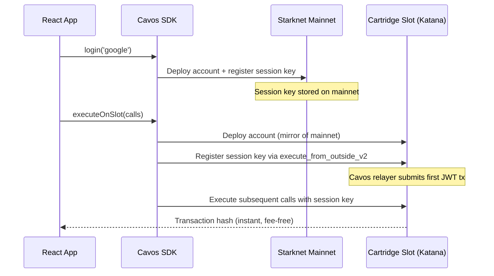

[Cartridge Slot](https://docs.cartridge.gg/slot) is a private, fee-free Katana chain forked from Starknet mainnet. It is purpose-built for games and high-throughput apps that need instant, zero-cost transactions.

Cavos integrates with Slot so that users can execute transactions on the Slot chain **without a paymaster** — Katana runs with `no_fee = true`, so gas is always free.

---

## How It Works



1. **Account deployment on mainnet** happens automatically after `login()`, as usual.
2. **First `executeOnSlot()` call** lazily deploys the account on Slot and registers the session key. The Cavos built-in relayer handles the `execute_from_outside_v2` call needed for JWT verification — no configuration required.
3. **Subsequent `executeOnSlot()` calls** use the session key directly — no relayer, no paymaster, just a direct invoke.

---

## Configuration

Add `slot` to your `CavosProvider` config:

```tsx
import { CavosProvider } from '@cavos/react';

export function Providers({ children }) {
  return (
    <CavosProvider
      config={{
        appId: 'your-app-id',
        network: 'mainnet',         // Slot is forked from mainnet
        paymasterApiKey: 'your-key',
        slot: {
          rpcUrl: 'https://api.cartridge.gg/x/your-project/katana',
          // chainId: '0x534e5f4d41494e', // Optional — skip if you want auto-detection
        },
      }}
    >
      {children}
    </CavosProvider>
  );
}
```

### `SlotConfig` Options

| Property | Type | Required | Description |
|----------|------|----------|-------------|
| `rpcUrl` | string | Yes | RPC URL of your Cartridge Katana Slot instance |
| `chainId` | string | No | Chain ID for the Slot chain (e.g. `'0x534e5f4d41494e'` for SN_MAIN). Omit to fetch dynamically from the RPC on each call. Providing it skips the extra round-trip. |

> [!NOTE]
> If `slot` is not present in the config, nothing Slot-related happens — `executeOnSlot()` will throw.

---

## Executing Transactions on Slot

Use `executeOnSlot()` instead of `execute()` to route transactions to the Slot chain:

```tsx
import { useCavos } from '@cavos/react';

function GameAction() {
  const { executeOnSlot, walletStatus } = useCavos();

  const handleMove = async () => {
    const txHash = await executeOnSlot({
      contractAddress: GAME_CONTRACT_ADDRESS,
      entrypoint: 'make_move',
      calldata: ['42', '7'],
    });

    console.log('Move submitted on Slot:', txHash);
  };

  return (
    <button onClick={handleMove} disabled={!walletStatus.isReady}>
      Make Move
    </button>
  );
}
```

### Multicall on Slot

```tsx
const txHash = await executeOnSlot([
  {
    contractAddress: RESOURCE_CONTRACT,
    entrypoint: 'collect',
    calldata: [playerId],
  },
  {
    contractAddress: GAME_CONTRACT,
    entrypoint: 'upgrade',
    calldata: [buildingId, '1'],
  },
]);
```

---

## Session Policy on Slot

The session policy configured in `CavosProvider` (`session.defaultPolicy`) applies to both mainnet and Slot transactions. Configure `allowedContracts` to include your Slot game contracts:

```tsx
<CavosProvider
  config={{
    appId: 'your-app-id',
    network: 'mainnet',
    paymasterApiKey: 'your-key',
    session: {
      defaultPolicy: {
        allowedContracts: [
          GAME_CONTRACT_ADDRESS,    // Same address on Slot as mainnet
          RESOURCE_CONTRACT_ADDRESS,
        ],
        maxCallsPerTx: 10,
      },
    },
    slot: {
      rpcUrl: 'https://api.cartridge.gg/x/your-project/katana',
    },
  }}
>
```

---

## Differences from `execute()`

| | `execute()` | `executeOnSlot()` |
|---|---|---|
| Target chain | Starknet mainnet / sepolia | Cartridge Slot (Katana) |
| Gas | Sponsored by Cavos Paymaster | Free (`no_fee = true`) |
| Paymaster needed | Yes (for sponsored) | No |
| First call overhead | None | Deploys account + registers session on Slot |
| Subsequent calls | Direct invoke or paymaster | Direct invoke with session key |

---

## Troubleshooting

| Symptom | Likely Cause | Fix |
|---------|-------------|-----|
| `executeOnSlot` throws "Slot not configured" | `slot` key missing from config | Add `slot: { rpcUrl: '...' }` to `CavosProvider` config |
| First Slot transaction takes long | Deploying account + registering session | Expected on the very first call — subsequent calls are instant |
| "Invalid session key signature" on Slot | SDK version before session key y-parity fix | Update `@cavos/react` to latest version |
| Transaction rejected on Slot | Contract not in session policy | Add contract to `allowedContracts` in `session.defaultPolicy` |
| Wrong chain ID | Custom Katana with non-standard chain ID | Pass `chainId` explicitly in `slot` config |
