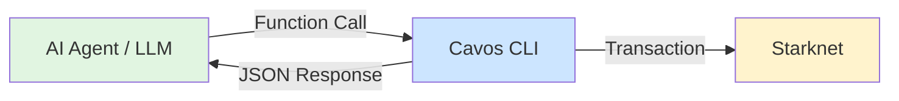

## Overview

The Cavos CLI is designed to work seamlessly with AI agents and autonomous systems. It provides:

- **JSON output** for easy parsing (`--json` flag)
- **OpenAI tool schema** for LLM function calling
- **Environment-based auth** (no interactive prompts)
- **Batch operations** via multicall



## Quick Start

### 1. Export Session from Dashboard

```bash
# In the Cavos Dashboard:
# Settings → Sessions → "Export for CLI"
export CAVOS_TOKEN="eyJzZXNz..."
```

### 2. Get Tool Schema

The CLI provides an OpenAI-compatible tool schema:

```bash
cavos tools list
```

**Output** (tools.json):
```json
[
  {
    "type": "function",
    "function": {
      "name": "cavos_balance",
      "description": "Show token balance for the current wallet...",
      "parameters": {
        "type": "object",
        "properties": {
          "token": {
            "type": "string",
            "description": "Token symbol (STRK, ETH) or contract address"
          }
        }
      }
    }
  },
  ...
]
```

### 3. Give Tools to Your AI Agent

**Example with OpenAI:**

```python
import openai
import subprocess
import json

# Load Cavos tools
tools = json.load(open('tools.json'))

# Create AI agent
response = openai.chat.completions.create(
    model="gpt-4",
    messages=[
        {"role": "system", "content": "You are a DeFi trading assistant with access to a Starknet wallet via Cavos CLI."},
        {"role": "user", "content": "Check my STRK balance and transfer 5 STRK to 0x123..."}
    ],
    tools=tools,
    tool_choice="auto"
)

# Execute tool calls
for tool_call in response.choices[0].message.tool_calls:
    if tool_call.function.name == "cavos_balance":
        result = subprocess.run(
            ["cavos", "balance", "--token", "STRK", "--json"],
            capture_output=True,
            text=True
        )
        print(json.loads(result.stdout))
    
    elif tool_call.function.name == "cavos_transfer":
        args = json.loads(tool_call.function.arguments)
        result = subprocess.run([
            "cavos", "transfer",
            "--to", args["to"],
            "--amount", args["amount"],
            "--token", args.get("token", "STRK"),
            "--wait",
            "--json"
        ], capture_output=True, text=True)
        print(json.loads(result.stdout))
```

---

## Available Tools

The CLI exposes 8 tools for AI agents:

| Tool | Purpose | Example |
|------|---------|---------|
| `cavos_whoami` | Get wallet info | Check session status |
| `cavos_balance` | Check token balances | Verify funds before transfer |
| `cavos_transfer` | Send ERC-20 tokens | Move funds |
| `cavos_approve` | Approve token spending | DeFi operations |
| `cavos_execute` | Arbitrary contract call | Custom interactions |
| `cavos_multicall` | Batch multiple calls | approve + swap in one tx |
| `cavos_session_status` | Check session on-chain | Diagnose failures |
| `cavos_policy_show` | View spending policy | Check remaining limits |

> [!TIP]
> Always call `cavos_whoami` first to ensure the agent is properly authenticated.

---

## Example Use Cases

### 1. DeFi Trading Bot

An AI agent that monitors prices and executes swaps:

```python
#!/usr/bin/env python3
import subprocess
import json

def check_balance(token):
    """Check token balance"""
    result = subprocess.run(
        ["cavos", "balance", "--token", token, "--json"],
        capture_output=True, text=True
    )
    data = json.loads(result.stdout)
    return float(data["balance"])

def swap_tokens(amount_in, token_in, token_out, swap_contract):
    """Approve + Swap tokens atomically"""
    calls = [
        {
            "contract": token_in,
            "entrypoint": "approve",
            "calldata": f"{swap_contract},{amount_in},0"
        },
        {
            "contract": swap_contract,
            "entrypoint": "swap",
            "calldata": f"{token_in},{token_out},{amount_in}"
        }
    ]
    
    result = subprocess.run([
        "cavos", "multicall",
        "--calls", json.dumps(calls),
        "--wait",
        "--json"
    ], capture_output=True, text=True)
    
    return json.loads(result.stdout)

# Main loop
while True:
    price = get_price_from_oracle()  # Your price oracle
    
    if price > TARGET_PRICE:
        balance = check_balance("STRK")
        if balance > 10:
            result = swap_tokens(
                amount_in="10000000000000000000",  # 10 STRK
                token_in="0x049d36...",
                token_out="0x053c91...",
                swap_contract="0x041fd..."
            )
            print(f"Swap executed: {result['txHash']}")
    
    time.sleep(60)
```

### 2. Portfolio Rebalancing Agent

An agent that maintains a target portfolio allocation:

```typescript
import { exec } from 'child_process';
import { promisify } from 'util';

const execAsync = promisify(exec);

async function getBalance(token: string): Promise<number> {
  const { stdout } = await execAsync(
    `cavos balance --token ${token} --json`
  );
  const data = JSON.parse(stdout);
  return parseFloat(data.balance);
}

async function transfer(to: string, amount: string, token: string) {
  const { stdout } = await execAsync(
    `cavos transfer --to ${to} --amount ${amount} --token ${token} --wait --json`
  );
  return JSON.parse(stdout);
}

// AI agent decides rebalancing strategy
const targetAllocation = {
  STRK: 0.6,  // 60%
  ETH: 0.4    // 40%
};

async function rebalance() {
  const strkBalance = await getBalance('STRK');
  const ethBalance = await getBalance('ETH');
  const total = strkBalance + ethBalance;
  
  const strkTarget = total * targetAllocation.STRK;
  const ethTarget = total * targetAllocation.ETH;
  
  if (Math.abs(strkBalance - strkTarget) > 0.1) {
    // Rebalance needed
    const amountToSwap = (strkBalance - strkTarget).toFixed(2);
    console.log(`Rebalancing: ${amountToSwap} STRK`);
    // ... execute swap
  }
}
```

### 3. On-Chain Task Automation

An agent that executes recurring on-chain tasks:

```python
#!/usr/bin/env python3
"""
Agent that monitors a contract and calls a function when conditions are met
"""
import subprocess
import json
import time

def execute_contract_call(contract, entrypoint, calldata):
    """Execute arbitrary contract call"""
    result = subprocess.run([
        "cavos", "execute",
        "--contract", contract,
        "--entrypoint", entrypoint,
        "--calldata", calldata,
        "--wait",
        "--json"
    ], capture_output=True, text=True)
    
    return json.loads(result.stdout)

# Monitor and execute
YIELD_CONTRACT = "0x041fd..."
while True:
    # Check if harvest is ready (via RPC call, not shown)
    ready_to_harvest = check_harvest_status(YIELD_CONTRACT)
    
    if ready_to_harvest:
        print("Harvesting yield...")
        result = execute_contract_call(
            contract=YIELD_CONTRACT,
            entrypoint="harvest",
            calldata=""  # No args
        )
        print(f"Harvest TX: {result['txHash']}")
    
    time.sleep(3600)  # Check every hour
```

---

## Error Handling

AI agents should handle CLI errors gracefully:

```python
import subprocess
import json

def safe_cli_call(command):
    """Execute CLI command with error handling"""
    try:
        result = subprocess.run(
            command,
            capture_output=True,
            text=True,
            check=False  # Don't raise on non-zero exit
        )
        
        if result.returncode != 0:
            # Parse error from stderr
            try:
                error = json.loads(result.stderr)
                return {
                    "success": False,
                    "error": error.get("message", result.stderr)
                }
            except:
                return {
                    "success": False,
                    "error": result.stderr
                }
        
        # Success
        return {
            "success": True,
            "data": json.loads(result.stdout)
        }
    
    except Exception as e:
        return {
            "success": False,
            "error": str(e)
        }

# Usage
result = safe_cli_call(["cavos", "balance", "--json"])
if result["success"]:
    print(f"Balance: {result['data']['balance']}")
else:
    print(f"Error: {result['error']}")
```

---

## Spending Limits for AI Agents

**Critical:** Always set strict spending limits when giving sessions to AI agents:

```typescript
// In the dashboard when creating the session
{
  allowedContracts: [
    '0x049d36...',  // STRK only
  ],
  spendingLimits: [
    { token: '0x049d36...', limit: 10n * 10n**18n }  // Max 10 STRK
  ],
  maxCallsPerTx: 5  // Prevent DOS
}
```

> [!CAUTION]
> An AI agent with an unlimited session could drain your wallet if it malfunctions or acts maliciously.

---

## CI/CD Integration

Use the CLI in GitHub Actions, GitLab CI, or other automation:

```yaml
# .github/workflows/deploy.yml
name: Deploy Contract

on:
  push:
    branches: [main]

jobs:
  deploy:
    runs-on: ubuntu-latest
    steps:
      - uses: actions/checkout@v3
      
      - name: Setup Cavos CLI
        run: |
          cd cli
          npm install
          npm run build
          npm link
      
      - name: Deploy
        env:
          CAVOS_TOKEN: ${{ secrets.CAVOS_CLI_TOKEN }}
        run: |
          # Check session
          cavos whoami
          
          # Deploy contract (example)
          cavos execute \
            --contract 0xFACTORY \
            --entrypoint deploy \
            --calldata "0x123,0x456" \
            --wait
```

---

## Monitoring & Logging

Track all CLI operations for debugging:

```python
import subprocess
import json
import logging

logging.basicConfig(level=logging.INFO)
logger = logging.getLogger("cavos-agent")

def logged_cli_call(command):
    """Execute CLI with full logging"""
    logger.info(f"Executing: {' '.join(command)}")
    
    result = subprocess.run(
        command,
        capture_output=True,
        text=True
    )
    
    if result.returncode == 0:
        data = json.loads(result.stdout)
        logger.info(f"Success: {json.dumps(data, indent=2)}")
        return data
    else:
        logger.error(f"Failed: {result.stderr}")
        raise Exception(result.stderr)
```

---

## Next Steps

<CardGroup cols={2}>
  <Card title="Examples" icon="code" href="/cli/examples">
    More practical workflows
  </Card>
  <Card title="Session Management" icon="key" href="/cli/session-management">
    Understand session policies
  </Card>
  <Card title="Commands Reference" icon="terminal" href="/cli/commands">
    Full CLI command list
  </Card>
</CardGroup>
