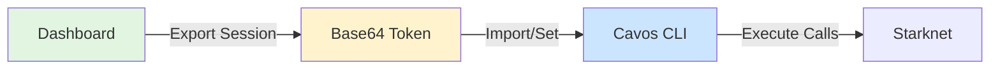

## Overview

The Cavos CLI operates using **session keys** exported from your dashboard. A session key is a limited-privilege private key that can execute transactions within the constraints of a **policy**.



## Session Components

A session token contains:

| Component |Description |
|-----------|-----------|
| **Session Private Key** | Signs all transactions (never leaves your device) |
| **Wallet Address** | The on-chain account address |
| **Network** | Mainnet |
| **App Salt** | Unique identifier for your application |

> [!WARNING]
> The session token is **sensitive**. Anyone with access to it can execute transactions within your policy limits.

## Session Lifecycle

### 1. Creation (Dashboard)

Sessions are created in the [Cavos Dashboard](https://cavos.xyz/dashboard):

1. Login with Google/Apple OAuth
2. Navigate to **Settings** → **Sessions**
3. Click **"Create New Session"** or use an existing one
4. Configure policy (allowed contracts, spending limits)
5. Click **"Activate Session"** to register it on-chain
6. Export the session token for CLI use

### 2. Export & Import

**Export from Dashboard:**
```
1. Dashboard → Settings → Sessions
2. Click "Export for CLI"
3. Copy base64 token
```

**Import to CLI:**
```bash
# Option 1: Environment variable
export CAVOS_TOKEN="eyJzZXNz..."

# Option 2: Import command
cavos session import eyJzZXNz...
```

### 3. Usage

Once imported, the CLI uses the session key to sign all transactions:

```bash
cavos balance
cavos transfer --to 0x... --amount 1.5 --token STRK
```

### 4. Expiration

Sessions expire after **~24 hours** by default. When expired:

```bash
$ cavos transfer --to 0x... --amount 1.5 --token STRK
Error: Session expired
```

**Solution:** Export a new session from the dashboard or renew the existing one (if within grace period).

### 5. Revocation

You can revoke sessions at any time from the dashboard:

1. Dashboard → Settings → Sessions
2. Click **"Revoke Session"** next to the session
3. Confirm revocation

**Emergency Revoke All:**
```typescript
// In the dashboard
await emergencyRevokeAllSessions();
```

This invalidates **all** active sessions for your wallet immediately.

## Session Policies

Policies define what a session key can and cannot do. They are enforced **on-chain** by your account contract.

### Allowed Contracts

Restrict which contracts the session can interact with:

```typescript
// Example policy
{
  allowedContracts: [
    '0x049d36570d4e46f48e99674bd3fcc84644ddd6b96f7c741b1562b82f9e004dc7', // STRK
    '0x053c91253bc9682c04929ca02ed00b3e423f6710d2ee7e0d5ebb06f3ecf368a8', // ETH
    '0x04718f5a0fc34cc1af16a1cdee98ffb20c31f5cd61d6ab07201858f4287c938d'  // DeFi Protocol
  ]
}
```

If you try to call a contract not in this list:

```bash
$ cavos execute --contract 0xUNKNOWN --entrypoint swap
Error: Contract not allowed by policy
```

### Spending Limits

Limit how much of each token the session can spend:

```typescript
{
  spendingLimits: [
    { token: '0x049d36...', limit: 100n * 10n**18n }, // 100 STRK
    { token: '0x053c91...', limit: 1n * 10n**18n }     // 1 ETH
  ]
}
```

The account contract tracks cumulative spending per session:

```bash
$ cavos policy show
Spending Limits:
  STRK: 45.0 / 100.0 used
  ETH: 0.3 / 1.0 used
```

If you exceed the limit:

```bash
$ cavos transfer --to 0x... --amount 60 --token STRK
Error: Spending limit exceeded (55.0 used, 100.0 limit)
```

### Max Calls Per Transaction

Limit the number of calls in a single transaction (for `multicall`):

```typescript
{
  maxCallsPerTx: 10
}
```

## Checking Session Status

Use `session status` to see the on-chain state of your session:

```bash
cavos session status
```

**Output:**
```
Session Key: 0x789abc...
Registered: Yes
Valid Until: 2024-03-15 10:30:00 UTC
Renewable: No
Calls Made: 42
```

**JSON Output:**
```bash
cavos session status --json
```

```json
{
  "sessionKey": "0x789abc...",
  "isRegistered": true,
  "validUntil": "2024-03-15T10:30:00Z",
  "isRenewable": false,
  "callsMade": 42
}
```

## Security Best Practices

### 1. Principle of Least Privilege

Only include contracts and limits you actually need:

**Bad (overly permissive):**
```typescript
{
  allowedContracts: ['*'],  // All contracts!
  spendingLimits: [
    { token: 'STRK', limit: 1000000n }  save// Way too much
  ]
}
```

**Good:**
```typescript
{
  allowedContracts: [
    '0x049d36...',  // STRK token only
  ],
  spendingLimits: [
    { token: 'STRK', limit: 10n * 10n**18n }  // 10 STRK
  ]
}
```

### 2. Short-Lived Sessions

Create sessions with shorter durations for sensitive operations:

- **Trading bots**: 1-2 hours
- **One-time tasks**: 30 minutes
- **Long-running agents**: 24 hours (default)

### 3. Secure Storage

**Never commit session tokens to Git:**

```bash
# .gitignore
.env
.cavos/
*.session
```

**Use environment variables:**

```bash
# In CI/CD
export CAVOS_TOKEN="${{ secrets.CAVOS_CLI_TOKEN }}"
```

### 4. Revoke When Done

Always revoke sessions when you're finished:

```bash
# In your script
trap "echo 'Revoking session...'; cavos revoke" EXIT
```

Or revoke manually from the dashboard.

## Multi-Device Sessions

You can use the same session on multiple devices:

```bash
# Device 1 (export from dashboard)
export CAVOS_TOKEN="eyJzZXNz..."
cavos balance

# Device 2 (same token)
export CAVOS_TOKEN="eyJzZXNz..."
cavos balance
```

Both devices share:
- Same wallet address
- Same spending limits
- Same policy

> [!CAUTION]
> If one device exceeds the spending limit, the other device will also be blocked.

## Troubleshooting

### "Session not registered"

**Cause:** Session was never activated on-chain.

**Solution:** In the dashboard, click **"Activate Session"** before exporting.

---

### "Session expired"

**Cause:** Session validity period (default 24h) has passed.

**Solution:** Export a new session from the dashboard.

---

### "Spending limit exceeded"

**Cause:** Cumulative token usage exceeded the policy limit.

**Solution:**
1. Check current usage: `cavos policy show`
2. Revoke old session (dashboard)
3. Create new session with higher limit

---

### "Contract not allowed"

**Cause:** Target contract not in `allowedContracts`.

**Solution:** Create a new session with the contract address included in the policy.

---

## Next Steps

<CardGroup cols={2}>
  <Card title="AI Agents" icon="robot" href="/cli/ai-agents">
    Use sessions with autonomous AI agents
  </Card>
  <Card title="Examples" icon="code" href="/cli/examples">
    Common workflows and patterns
  </Card>
  <Card title="Advanced Security" icon="shield" href="/advanced/security">
    Deep dive into security architecture
  </Card>
</CardGroup>
