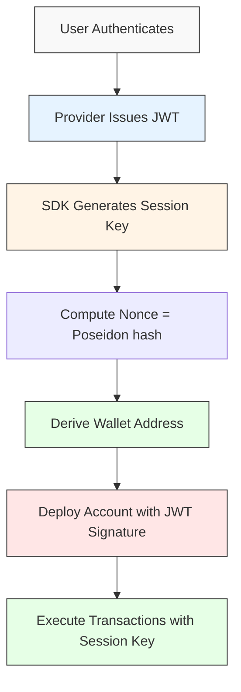

## OAuth Wallets with JWT Verification

Cavos creates **self-custodial StarkNet wallets** tied to your OAuth identity (Google, Apple, or Firebase). Your wallet address is deterministically derived from your provider's user ID, ensuring the same account always gets the same wallet across devices.

### How It Works



### Authentication Flow

1. **User Authenticates**: Login with Google, Apple, or Firebase email/password
2. **JWT Issued**: Provider returns a signed JWT token with user identity
3. **Session Key Generated**: SDK creates a temporary ECDSA keypair (Stark curve)
4. **Nonce Computation**: `nonce = Poseidon(sessionPubKey, maxBlock, randomness)`
5. **Address Derivation**: `addressSeed = Poseidon(sub, app_salt)` → deterministic wallet address
6. **On-Chain Verification**: Smart contract verifies JWT RSA signature and registers session key

### JWT Verification On-Chain

Unlike traditional session keys, Cavos uses **JWT signature verification** directly on-chain:

```typescript
// JWT contains:
{
  sub: "google-oauth2|123456",  // User ID from provider
  nonce: "0x...",                // Poseidon hash of session key
  iss: "https://accounts.google.com",
  aud: "your-client-id",
  exp: 1234567890
}
```

**On first transaction:**
- Contract verifies RSA-2048 signature of JWT
- Validates nonce matches session public key
- Registers session key for this session
- Executes transaction

**Subsequent transactions:**
- Signed with lightweight session key signature
- No need to re-verify full JWT
- Much cheaper gas cost

### Session Keys

Session keys are temporary signing keys that expire after a configured duration:

| Property | Description |
|----------|-------------|
| **Lifetime** | ~24 hours (configurable via `sessionDuration`) |
| **Storage** | SessionStorage (cleared on browser close) |
| **Renewal** | Can generate new session key and re-register |
| **Revocation** | Automatic on expiry or manual logout |

**Key Differences from Session Keys:**
- No policy restrictions (full wallet control)
- Registered on-chain via JWT verification
- Expire based on block height, not timestamp
- Can be renewed during grace period

### Security Model

| Aspect | Behavior |
|--------|----------|
| **JWT Token** | Issued by OAuth provider, verified on-chain |
| **Session Key** | Generated client-side, registered via JWT |
| **Wallet Address** | Deterministically derived from OAuth `sub` claim |
| **Private Key** | Never stored - wallets are OAuth-based, not key-based |
| **Expiration** | Session keys expire after ~24 hours |
| **Renewal** | Generate new session key, verify with same JWT |

> [!IMPORTANT]
> Cavos wallets are **OAuth-based**, not private-key-based. Your identity (Google/Apple/Firebase account) IS your wallet. No seed phrases, no private keys to manage.

### Address Derivation

Wallet addresses are computed deterministically:

```
addressSeed = Poseidon(sub, app_salt)

walletAddress = calculateContractAddressFromHash(
  salt: addressSeed,
  classHash: cavosAccountClassHash,
  constructorCalldata: [addressSeed, jwksRegistryAddress, deployerAddress],
  deployer: 0x0
)
```

- **sub**: OAuth user ID (Google: `google-oauth2|123`, Firebase: `uid`)
- **app_salt**: Per-app salt (isolates wallets between apps)
- **Same user + Same app = Same wallet address**

## Authentication Methods

### OAuth Providers (Google/Apple)

- **Identity**: Email, name, profile picture
- **Verification**: JWT signed by provider's RSA keys
- **Recovery**: Login again with same account
- **Cross-device**: Same OAuth account = same wallet everywhere

### Email/Password (Firebase)

- **Identity**: Email (verified required)
- **Verification**: Custom JWT signed by Cavos with RSA-2048
- **Recovery**: Login with same email/password
- **Security**: Email verification prevents unauthorized access

### Passkey-Only

- **Identity**: Anonymous (no email)
- **Verification**: WebAuthn passkey
- **Recovery**: Device-based (iCloud Keychain, Google Password Manager)
- **Privacy**: No personal information collected

## Gasless Transactions

All transactions through Cavos are **gasless by default**. Users never need to hold ETH.

### How It Works

1. User initiates a transaction via `execute()`
2. SDK signs with session key and sends to AVNU Paymaster
3. Paymaster sponsors the gas fee
4. Transaction is executed on-chain

### AVNU Paymaster

Cavos uses AVNU's paymaster infrastructure:

| Network | Paymaster | Cost |
|---------|-----------|------|
| Starknet Sepolia | Shared | Free |
| Starknet Mainnet | Per-app | Paid via dashboard |

## Account Abstraction (AA)

Starknet has native account abstraction, meaning every account is a smart contract. Cavos wallets use a **custom OAuth account contract**:

```
Account Class Hash: [OAuth Account with JWT verification]
```

### Account Features

- **JWT Verification**: On-chain RSA signature verification
- **Session Keys**: Lightweight signing after JWT registration
- **Self-Deploy**: Accounts deploy themselves via paymaster
- **Multi-call**: Execute multiple transactions atomically
- **Upgradeable**: Account logic can be upgraded

### Deployment

Accounts are deployed **automatically after login**. Cavos handles this entirely in the background:

1. Wallet address is computed deterministically from OAuth identity
2. Account can receive funds before deployment (precomputed address)
3. After login, the SDK automatically:
   - Deploys the account contract via paymaster (gasless)
   - Registers the session key on-chain using the JWT signature
   - Updates `walletStatus.isReady = true` when complete
4. All subsequent transactions use the lightweight session key signature

**Key Insight**: No relayer needed and no manual steps! Deploy + session registration happen automatically after `login()`.

## Transaction Flow

### After Login (Automatic Setup)

```
User calls login('google')
  ↓
SDK authenticates + generates session key
  ↓
SDK auto-deploys account (if needed)
  → JWT RSA signature verified on-chain
  → Session key registered on-chain
  ↓
walletStatus.isReady = true ✅
```

### Transactions (All Automatic)

```
User calls execute()
  ↓
SDK signs with session key
  ↓
Lightweight signature (no JWT)
  ↓
AVNU Paymaster sponsors gas
  ↓
On-chain:
  1. Verify session key signature
  2. Check key not expired
  3. Execute transaction
```

> If the session isn't registered yet (e.g., background registration still in progress), `execute()` automatically falls back to JWT signature to register + execute in one atomic transaction.

### Session Key Renewal

When session key expires:

```
SDK detects expiration
  ↓
Generates new session keypair
  ↓
Computes new nonce
  ↓
Signs with old session key + includes new JWT
  ↓
On-chain:
  1. Verify old session key (still valid in grace period)
  2. Verify JWT signature for new session key
  3. Register new session key
  4. Old key marked as replaced
```

## Authentication Flows

### OAuth (Google/Apple)

```
User → OAuth Login → JWT from Provider → Session Key Generated →
Wallet Address Derived → Ready to Transact
```

### Email/Password (Firebase)

```
User → Register + Verify Email → Login → Custom JWT from Cavos →
Session Key Generated → Wallet Address Derived → Ready to Transact
```

### Passkey-Only (Anonymous)

```
User → Passkey Registration → Anonymous Wallet Created →
WebAuthn Signature → Ready to Transact
```

## Network Support

| Network | Status | Paymaster |
|---------|--------|-----------|
| Starknet Mainnet | Supported | AVNU (paid) |
| Starknet Sepolia | Supported | AVNU (free) |

## Key Advantages

| Feature | Benefit |
|---------|---------|
| **No Seed Phrases** | Your OAuth account IS your wallet |
| **Cross-Device** | Same login = same wallet everywhere |
| **Gasless** | Never need to buy crypto to transact |
| **Self-Deploy** | No relayer, account deploys itself |
| **On-Chain Verification** | JWT signature verified on-chain |
| **Secure** | Session keys expire, JWT can't be reused |
