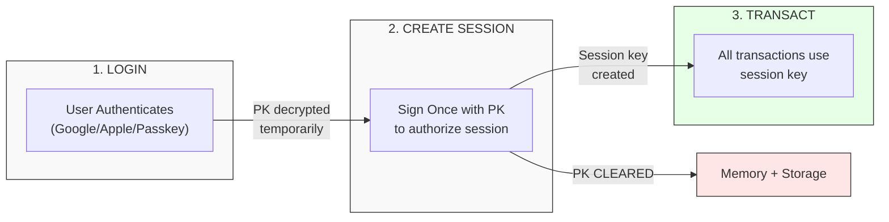

## Session Keys (Core)

Session keys are the **foundation** of Cavos's transaction signing. They provide a seamless user experience by eliminating repeated signature prompts.

### How It Works



### Session Policy

Each session has a **policy** that defines what actions it can perform:

```typescript
const sessionPolicy = {
  allowedMethods: [
    { contractAddress: '0x...token', selector: 'transfer' },
    { contractAddress: '0x...token', selector: 'approve' },
    { contractAddress: '0x...nft', selector: 'mint' },
  ],
  expiresAt: Date.now() + 60 * 60 * 1000, // 1 hour
};
```

- **allowedMethods**: Specific contract + function combinations the session can call
- **expiresAt**: When the session expires (default: 1 hour)

### Security Model

| Aspect | Behavior |
|--------|----------|
| Private Key | Used ONLY for session creation, then cleared |
| Session Key | Stored in browser sessionStorage |
| Scope | Limited to allowedMethods in policy |
| Expiration | Auto-expires after defined time |
| Revocation | User can clear session at any time |

> [!IMPORTANT]
> After session creation, the user's private key is **permanently removed** from memory. The `execute()` method cannot access it - only session keys can sign transactions.

## Passkeys (WebAuthn)

Passkeys are a modern authentication standard that replaces passwords with device biometrics. When a user authenticates with Cavos:

1. The device generates a cryptographic key pair
2. The private key is stored securely in the device's secure enclave (TPM/Secure Element)
3. Authentication requires biometric verification (FaceID, TouchID, Windows Hello)

### Passkey Encryption

Cavos uses the WebAuthn PRF (Pseudo-Random Function) extension to derive an encryption key from the passkey. This key encrypts the wallet's private key:

- **At rest**: Private key is encrypted with AES-GCM using the passkey-derived key
- **In use**: Private key is decrypted only during session creation
- **After session**: Private key is immediately cleared from memory

### Benefits

- No passwords to remember or steal
- Phishing-resistant (bound to specific domains)
- Hardware-backed security
- Cross-device recovery via passkey sync (iCloud Keychain, Google Password Manager)

## Gasless Transactions

All transactions through Cavos are **gasless by default**. Users never need to hold ETH.

### How It Works

1. User initiates a transaction via `execute()`
2. SDK signs with session key and sends to AVNU Paymaster
3. Paymaster sponsors the gas fee
4. Transaction is executed on-chain

### AVNU Paymaster

Cavos uses AVNU's paymaster infrastructure:

| Network | Paymaster | Cost |
|---------|-----------|------|
| Starknet Sepolia | Shared | Free |
| Starknet Mainnet | Per-app | Paid via dashboard |

## Account Abstraction (AA)

Starknet has native account abstraction, meaning every account is a smart contract. Cavos wallets use the **ArgentX account contract**:

```
Account Class Hash: 0x036078334509b514626504edc9fb252328d1a240e4e948bef8d0c08dff45927f
```

### Account Features

- **Session Support**: Native session key integration via Argent's session library
- **Upgradeable**: Account logic can be upgraded
- **Multi-call**: Execute multiple transactions atomically

### Deployment

Accounts are deployed lazily when first used. Cavos handles this automatically:

1. On wallet creation, the account address is computed deterministically
2. The account can receive funds before deployment
3. On first transaction, the account is deployed via paymaster

## Authentication Flows

### OAuth + Passkey (Recommended)

```
User → Google/Apple OAuth → Identity Verified → Passkey Registration → Wallet Created → Session Created
```

### Passkey-Only (Anonymous)

```
User → Passkey Registration → Anonymous Wallet Created → Session Created
```

## Network Support

| Network | Status | Paymaster |
|---------|--------|-----------|
| Starknet Mainnet | Supported | AVNU (paid) |
| Starknet Sepolia | Supported | AVNU (free) |
