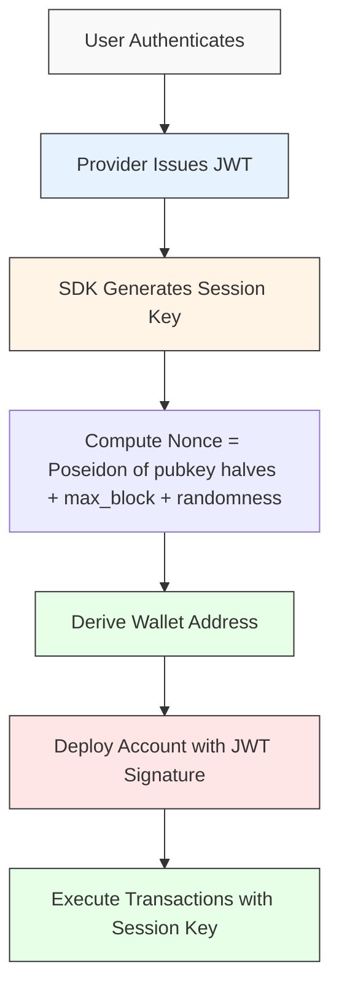

## OAuth Wallets with JWT Verification

Cavos creates **self-custodial StarkNet wallets** tied to your OAuth identity (Google, Apple, or Firebase). Your wallet address is deterministically derived from your provider's user ID, ensuring the same account always gets the same wallet across devices.

### How It Works


```mermaid
flowchart TD
    A[User Authenticates] --> B[Provider Issues JWT]
    B --> C[SDK Generates Session Key]
    C --> D[Compute Nonce = Poseidon of pubkey halves + max_block + randomness]
    D --> E[Derive Wallet Address]
    E --> F[Deploy Account with JWT Signature]
    F --> G[Execute Transactions with Session Key]

    style A fill:#f9f9f9,stroke:#333
    style B fill:#e6f3ff,stroke:#333
    style C fill:#fff4e6,stroke:#333
    style E fill:#e6ffe6,stroke:#333
    style F fill:#ffe6e6,stroke:#333
    style G fill:#e6ffe6,stroke:#333
```

### Authentication Flow

1. **User Authenticates**: Login with Google, Apple, or Magic Link
2. **JWT Issued**: Provider returns a signed JWT token with user identity
3. **Session Key Generated**: SDK creates a temporary ECDSA keypair (Stark curve)
4. **Nonce Computation**: `nonce = Poseidon(eph_pubkey_lo, eph_pubkey_hi, max_block, randomness)` — embedded in the JWT before the OAuth redirect
5. **Address Derivation**: `addressSeed = Poseidon(sub, salt)` → deterministic wallet address
6. **On-Chain Verification**: Smart contract verifies JWT RSA signature and registers session key

### JWT Verification On-Chain

Unlike traditional session keys, Cavos uses **JWT signature verification** directly on-chain:

```typescript
// JWT contains:
{
  sub: "google-oauth2|123456",  // User ID from provider
  nonce: "0x...",               // Poseidon(eph_pubkey_lo, eph_pubkey_hi, max_block, randomness)
  iss: "https://accounts.google.com",
  aud: "your-client-id",
  exp: 1234567890
}
```

**On first transaction:**
- Contract fetches the RSA-2048 public key from the on-chain JWKS registry
- Garaga's `is_valid_rsa2048_sha256_signature` verifies the JWT RSA-2048 signature (~11.8M gas)
- Validates nonce matches the registered session public key
- Registers session key for this session
- Executes transaction

**Subsequent transactions:**
- Signed with lightweight session key signature
- No need to re-verify full JWT
- Much cheaper gas cost

### JWKS Registry & Argus

The RSA public keys used for JWT verification are stored on-chain in the **JWKS registry**. Keys are registered permissionlessly via **Argus** (the trustless JWKS registry v2):

- **Permissionless**: Anyone can submit a proof to register or update a key
- **Trustless**: Keys are registered via Reclaim zkFetch proofs—no admin approval required
- **Hardcoded providers**: Argus accepts keys only from Google, Apple, and Firebase JWKS endpoints (verified by URL hash, not configurable at runtime)
- **Key format**: Each RSA-2048 public key is stored as 24 × felt252 values (96-bit limbs in Garaga's RSA2048Chunks format)

| Network | JWKSRegistry | Argus (trustless) |
|---------|-------------|-------------------|
| Sepolia | `0x0112c6a8a69e4d9a2e74b4638e1495d69266de9f6f796727d4a52a7ab0a48db2` | `0x07cd8487786091e4a2c1841cad4e16b815d61a068383c2a2b15dcb2415f1d767` |
| Mainnet | `0x076ff6853197538b4d4c925b2c775014fae9b5c14f63262b13f2e49f732e21f7` | `0x00cbcd49655919c0628fd7d999f8aadcb167a0450a75f9dfffef8ad8175f1de4` |

### Session Keys

Session keys are temporary signing keys that expire after a configured duration:

| Property | Description |
|----------|-------------|
| **Lifetime** | ~24 hours (configurable via `sessionDuration`) |
| **Storage** | SessionStorage (cleared on browser close) |
| **Renewal** | Can generate new session key and re-register |
| **Revocation** | Automatic on expiry or manual logout |

**Key properties of session keys:**
- No master private key ever exists — sessions are the only signing mechanism
- Registered on-chain via JWT verification
- Expire based on block height (`max_block`), not wall-clock time
- Can be renewed during a grace period without a fresh OAuth login

### Security Model

| Aspect | Behavior |
|--------|----------|
| **JWT Token** | Issued by OAuth provider, verified on-chain |
| **Session Key** | Generated client-side, registered via JWT |
| **Wallet Address** | Deterministically derived from OAuth `sub` claim |
| **Private Key** | Never stored - wallets are OAuth-based, not key-based |
| **Expiration** | Session keys expire after ~24 hours |
| **Renewal** | Generate new session key, verify with same JWT |

> [!IMPORTANT]
> Cavos wallets are **OAuth-based**, not private-key-based. Your identity (Google/Apple account) IS your wallet. No seed phrases, no private keys to manage.

### Address Derivation

Wallet addresses are computed deterministically:

```
addressSeed = Poseidon(sub, salt)

walletAddress = calculate_contract_address_from_hash(
  salt:                 addressSeed,
  class_hash:           cavosAccountClassHash,
  constructor_calldata: [addressSeed, jwksRegistryAddress],
  deployer_address:     0x0
)
```

- **sub**: OAuth user ID (e.g. Google's `sub` claim, Apple's `sub` claim)
- **salt**: Per-app salt derived from your App ID (isolates wallets between apps)
- **cavosAccountClassHash**: `0x5426dc61fb0cbbe0a04ab63d926f321552ece71e2014c6a42faab493385e0a2`
- **Same user + Same app = Same wallet address, every time**

## Authentication Methods

### OAuth Providers (Google/Apple)

- **Identity**: Email, name, profile picture
- **Verification**: JWT signed by provider's RSA keys
- **Recovery**: Login again with same account
- **Cross-device**: Same OAuth account = same wallet everywhere

### Magic Link

- **Identity**: Email (passwordless)
- **Verification**: Custom JWT signed via Cavos backend
- **Recovery**: Send a new magic link to the same email
- **UX**: No password to remember or manage

## Gasless Transactions

All transactions through Cavos are **gasless by default**. Users never need to hold ETH.

### How It Works

1. User initiates a transaction via `execute()`
2. SDK signs with session key and sends to AVNU Paymaster
3. Paymaster sponsors the gas fee
4. Transaction is executed on-chain

### AVNU Paymaster

Cavos uses AVNU's paymaster infrastructure:

| Network | Paymaster | Cost |
|---------|-----------|------|
| Starknet Sepolia | Shared | Free |
| Starknet Mainnet | Per-app | Paid via dashboard |

## Account Abstraction (AA)

Starknet has native account abstraction, meaning every account is a smart contract. Cavos wallets use a **custom OAuth account contract**:

```
Account Class Hash: 0x5426dc61fb0cbbe0a04ab63d926f321552ece71e2014c6a42faab493385e0a2
```

### Account Features

- **JWT Verification**: On-chain RSA signature verification
- **Session Keys**: Lightweight signing after JWT registration
- **Self-Deploy**: Accounts deploy themselves via paymaster
- **Multi-call**: Execute multiple transactions atomically
- **Upgradeable**: Account logic can be upgraded

### Deployment

Accounts are deployed **automatically after login**. Cavos handles this entirely in the background:

1. Wallet address is computed deterministically from OAuth identity
2. Account can receive funds before deployment (precomputed address)
3. After login, the SDK automatically:
   - Deploys the account contract via paymaster (gasless)
   - Registers the session key on-chain using the JWT signature
   - Updates `walletStatus.isReady = true` when complete
4. All subsequent transactions use the lightweight session key signature

**Key Insight**: No relayer needed and no manual steps! Deploy + session registration happen automatically after `login()`.

## Transaction Flow

### After Login (Automatic Setup)

```
User calls login('google')
  ↓
SDK authenticates + generates session key
  ↓
SDK auto-deploys account (if needed)
  → JWT RSA signature verified on-chain
  → Session key registered on-chain
  ↓
walletStatus.isReady = true ✅
```

### Transactions (All Automatic)

```
User calls execute()
  ↓
SDK signs with session key
  ↓
Lightweight signature (no JWT)
  ↓
AVNU Paymaster sponsors gas
  ↓
On-chain:
  1. Verify session key signature
  2. Check key not expired
  3. Execute transaction
```

> If the session isn't registered yet (e.g., background registration still in progress), `execute()` automatically falls back to JWT signature to register + execute in one atomic transaction.

### Session Key Renewal

When session key expires:

```
SDK detects expiration
  ↓
Generates new session keypair
  ↓
Computes new nonce
  ↓
Signs with old session key + includes new JWT
  ↓
On-chain:
  1. Verify old session key (still valid in grace period)
  2. Verify JWT signature for new session key
  3. Register new session key
  4. Old key marked as replaced
```

## Authentication Flows

### OAuth (Google/Apple)

```
User → OAuth Login → JWT from Provider → Session Key Generated →
Wallet Address Derived → Ready to Transact
```

### Magic Link

```
User → Enter Email → Magic Link Sent → User Clicks Link →
Custom JWT from Cavos → Session Key Generated →
Wallet Address Derived → Ready to Transact
```

## Network Support

| Network | Status | Paymaster |
|---------|--------|-----------|
| Starknet Mainnet | Supported | AVNU (paid) |
| Starknet Sepolia | Supported | AVNU (free) |

## Key Advantages

| Feature | Benefit |
|---------|---------|
| **No Seed Phrases** | Your OAuth account IS your wallet |
| **Cross-Device** | Same login = same wallet everywhere |
| **Gasless** | Never need to buy crypto to transact |
| **Self-Deploy** | No relayer, account deploys itself |
| **On-Chain Verification** | JWT signature verified on-chain |
| **Secure** | Session keys expire, JWT can't be reused |
