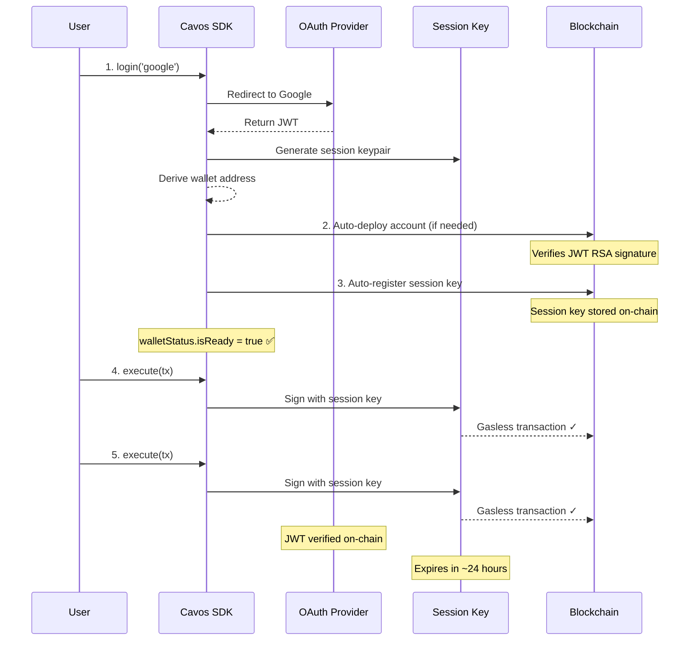

## Prerequisites

- A Cavos App ID from the [Dashboard](https://cavos.xyz/dashboard)
- A React or Next.js application

## Installation

<Tabs>
  <Tab title="npm">
    ```bash
    npm install @cavos/react starknet
    ```
  </Tab>
  <Tab title="yarn">
    ```bash
    yarn add @cavos/react starknet
    ```
  </Tab>
  <Tab title="pnpm">
    ```bash
    pnpm add @cavos/react starknet
    ```
  </Tab>
</Tabs>

## Setup

### 1. Configure the Provider

Wrap your application with `CavosProvider`:

```tsx
// app/layout.tsx or _app.tsx
import { CavosProvider } from '@cavos/react';

export default function RootLayout({ children }) {
  return (
    <CavosProvider
      config={{
        appId: 'your-app-id',
        network: 'sepolia', // or 'mainnet'
        session: {
          defaultPolicy: {
            allowedContracts: [
              '0x049d36570d4e46f48e99674bd3fcc84644ddd6b96f7c741b1562b82f9e004dc7' // STRK
            ],
            spendingLimits: [
              { token: '0x049d36570d4e46f48e99674bd3fcc84644ddd6b96f7c741b1562b82f9e004dc7', limit: 10n * 10n**18n } // 10 STRK
            ],
            maxCallsPerTx: 10
          }
        }
      }}
    >
      {children}
    </CavosProvider>
  );
}
```

### 2. Authentication

Cavos supports multiple authentication methods:

```tsx
'use client';
import { useCavos, useSession } from '@cavos/react';

export function AuthButtons() {
  const { login, register, isAuthenticated, address } = useCavos();
  const [email, setEmail] = useState('');
  const [password, setPassword] = useState('');

  // Social Login (Google/Apple)
  const handleSocialLogin = async (provider) => {
    await login(provider); // 'google' or 'apple'
  };

  // Email/Password Registration
  const handleRegister = async () => {
    try {
      await register('firebase', { email, password });
      alert('Check your email to verify your account!');
    } catch (error) {
      if (error.error === 'rate_limited') {
        alert(`Wait ${error.wait_seconds} seconds before trying again`);
      }
    }
  };

  // Email/Password Login
  const handleEmailLogin = async () => {
    try {
      await login('firebase', { email, password });
    } catch (error) {
      if (error.name === 'EmailNotVerifiedError') {
        alert('Please verify your email before logging in');
      }
    }
  };

  if (isAuthenticated && address) {
    return <p>Connected: {address.slice(0, 6)}...{address.slice(-4)}</p>;
  }

  return (
    <div>
      {/* Social Login */}
      <button onClick={() => handleSocialLogin('google')}>
        Login with Google
      </button>
      <button onClick={() => handleSocialLogin('apple')}>
        Login with Apple
      </button>

      {/* Email/Password */}
      <div>
        <input
          type="email"
          value={email}
          onChange={(e) => setEmail(e.target.value)}
          placeholder="Email"
        />
        <input
          type="password"
          value={password}
          onChange={(e) => setPassword(e.target.value)}
          placeholder="Password"
        />
        <button onClick={handleRegister}>Register</button>
        <button onClick={handleEmailLogin}>Login</button>
      </div>
    </div>
  );
}
```

### 3. Execute Transactions

After authentication, you're ready to execute transactions. No additional setup required!

```tsx
import { useCavos } from '@cavos/react';

function TransferButton() {
  const { execute, isAuthenticated, address } = useCavos();

  const handleTransfer = async () => {
    // No wallet popup! Session key signs automatically
    const txHash = await execute({
      contractAddress: '0x049d36570d4e46f48e99674bd3fcc84644ddd6b96f7c741b1562b82f9e004dc7',
      entrypoint: 'transfer',
      calldata: [recipientAddress, amount, '0'],
    });
    console.log('Transaction:', txHash);
  };

  if (!isAuthenticated || !address) {
    return <p>Please login first</p>;
  }

  return (
    <button onClick={handleTransfer}>
      Send Transfer (Gasless)
    </button>
  );
}
```

**How it works:**
1. After login, SDK generates a session key
2. SDK automatically deploys the account (if needed) and registers the session — no manual steps
3. `walletStatus.isReady` becomes `true` when the wallet is fully operational
4. All transactions are signed with session key (fast & cheap) and **gasless** via AVNU Paymaster
5. Session keys expire after ~24 hours and auto-renew

## The Flow



## Next Steps

<CardGroup cols={2}>
  <Card title="Core Concepts" icon="book" href="/concepts">
    Understand OAuth wallets, JWT verification, and session keys.
  </Card>
  <Card title="Authentication" icon="lock" href="/web/authentication">
    Learn about Google, Apple, and Firebase email/password flows.
  </Card>
  <Card title="Transactions" icon="paper-plane" href="/web/transactions">
    Execute gasless transactions with session keys.
  </Card>
  <Card title="React Hooks" icon="react" href="/web/react-hooks">
    Full useCavos API reference.
  </Card>
</CardGroup>
