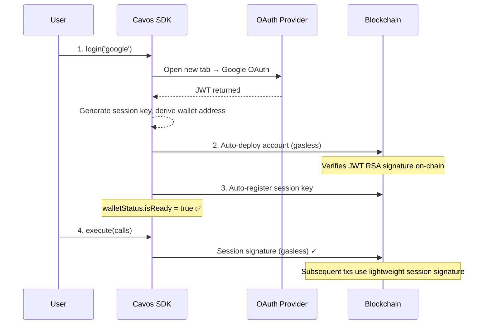

## Prerequisites

- A Cavos App ID from the [Dashboard](https://cavos.xyz/dashboard)
- A React or Next.js application

## Installation

<Tabs>
  <Tab title="npm">
    ```bash
    npm install @cavos/react starknet
    ```
  </Tab>
  <Tab title="yarn">
    ```bash
    yarn add @cavos/react starknet
    ```
  </Tab>
  <Tab title="pnpm">
    ```bash
    pnpm add @cavos/react starknet
    ```
  </Tab>
</Tabs>

## Setup

### 1. Configure the Provider

Wrap your application with `CavosProvider`:

```tsx
// app/providers.tsx
'use client';

import { CavosProvider, SessionKeyPolicy } from '@cavos/react';

const SESSION_POLICY: SessionKeyPolicy = {
  allowedContracts: [
    '0x04718f5a0Fc34cC1AF16A1cdee98fFB20C31f5cD61D6Ab07201858f4287c938D', // STRK
  ],
  spendingLimits: [
    {
      token: '0x04718f5a0Fc34cC1AF16A1cdee98fFB20C31f5cD61D6Ab07201858f4287c938D',
      limit: BigInt('10000000000000000000'), // 10 STRK
    },
  ],
  maxCallsPerTx: 5,
};

export function Providers({ children }: { children: React.ReactNode }) {
  return (
    <CavosProvider
      config={{
        appId: process.env.NEXT_PUBLIC_CAVOS_APP_ID || '',
        network: 'sepolia', // or 'mainnet'
        paymasterApiKey: process.env.NEXT_PUBLIC_CAVOS_PAYMASTER_API_KEY || '',
        session: { defaultPolicy: SESSION_POLICY },
      }}
      modal={{ appName: 'My App', theme: 'dark' }}
    >
      {children}
    </CavosProvider>
  );
}
```

```tsx
// app/layout.tsx
import { Providers } from './providers';

export default function RootLayout({ children }) {
  return (
    <html>
      <body>
        <Providers>{children}</Providers>
      </body>
    </html>
  );
}
```

### 2. Authentication

```tsx
'use client';
import { useCavos } from '@cavos/react';

export function AuthButtons() {
  const { login, sendMagicLink, isAuthenticated, address } = useCavos();

  if (isAuthenticated && address) {
    return <p>Connected: {address.slice(0, 6)}...{address.slice(-4)}</p>;
  }

  return (
    <div>
      <button onClick={() => login('google')}>Login with Google</button>
      <button onClick={() => login('apple')}>Login with Apple</button>
      <button onClick={() => sendMagicLink('user@example.com')}>
        Send Magic Link
      </button>
    </div>
  );
}
```

### 3. Execute Transactions

After authentication, transactions work immediately. No additional setup required.

```tsx
import { useCavos } from '@cavos/react';

function TransferButton() {
  const { execute, walletStatus } = useCavos();

  const handleTransfer = async () => {
    // No wallet popup — session key signs automatically, gas is sponsored
    const txHash = await execute({
      contractAddress: '0x04718f5a0fc34cc1af16a1cdee98ffb20c31f5cd61d6ab07201858f4287c938d', // STRK
      entrypoint: 'transfer',
      calldata: [recipientAddress, amountLow, amountHigh], // uint256 = [low, high]
    });
    console.log('Transaction:', txHash);
  };

  if (!walletStatus.isReady) {
    return <p>{walletStatus.isDeploying ? 'Deploying...' : 'Setting up...'}</p>;
  }

  return <button onClick={handleTransfer}>Transfer STRK (Gasless)</button>;
}
```

**How it works:**
1. After `login()`, the SDK generates a session key and derives the wallet address
2. The account is deployed automatically (gasless via AVNU Paymaster) if not yet on-chain
3. The session key is registered on-chain — `walletStatus.isReady` becomes `true`
4. All transactions are signed with the session key (no popups) and sponsored by the paymaster
5. Sessions expire after 24h and auto-renew within a 48h grace period

## The Flow


```mermaid
sequenceDiagram
    participant U as User
    participant SDK as Cavos SDK
    participant OAuth as OAuth Provider
    participant Chain as Blockchain

    U->>SDK: 1. login('google')
    SDK->>OAuth: Open new tab → Google OAuth
    OAuth-->>SDK: JWT returned
    SDK-->>SDK: Generate session key, derive wallet address

    SDK->>Chain: 2. Auto-deploy account (gasless)
    Note over Chain: Verifies JWT RSA signature on-chain
    SDK->>Chain: 3. Auto-register session key
    Note over SDK: walletStatus.isReady = true ✅

    U->>SDK: 4. execute(calls)
    SDK->>Chain: Session signature (gasless) ✓

    Note over Chain: Subsequent txs use lightweight session signature
```

## Next Steps

<CardGroup cols={2}>
  <Card title="Core Concepts" icon="book" href="/concepts">
    Understand OAuth wallets, JWT verification, and session keys.
  </Card>
  <Card title="Authentication" icon="lock" href="/web/authentication">
    Google, Apple, and Magic Link flows.
  </Card>
  <Card title="Transactions" icon="paper-plane" href="/web/transactions">
    Gasless transactions, multicall, and session policies.
  </Card>
  <Card title="React Hooks" icon="react" href="/web/react-hooks">
    Full useCavos API reference.
  </Card>
</CardGroup>
